<h1> School Management System Using Django </h1>

<h4>Login Panel</h4>

 
<h4>Admin Area</h4>

Add Teachers

Update & Delete Teachers Details

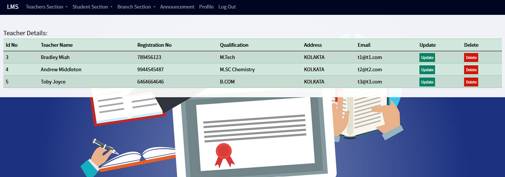

Assign Class

Update & Delte Assign Class

Add Student
 
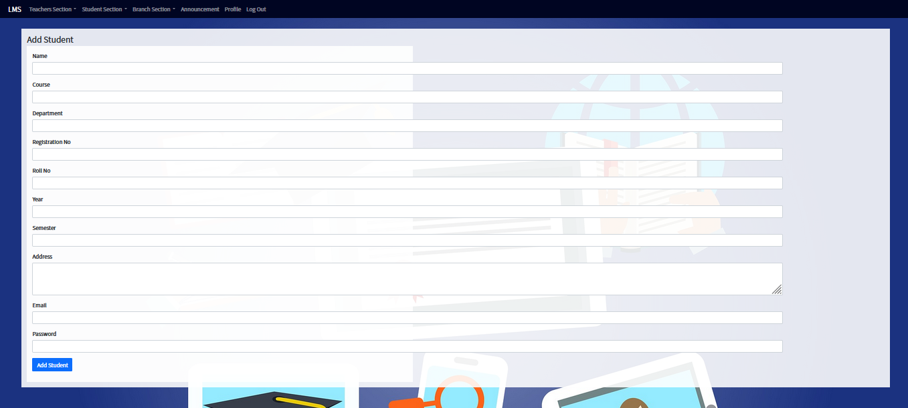

Update & Delte Students Details

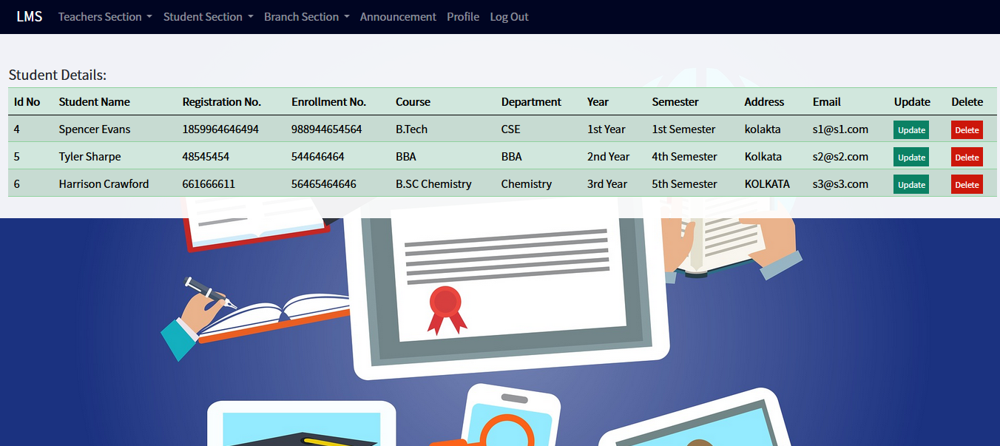

Add Course

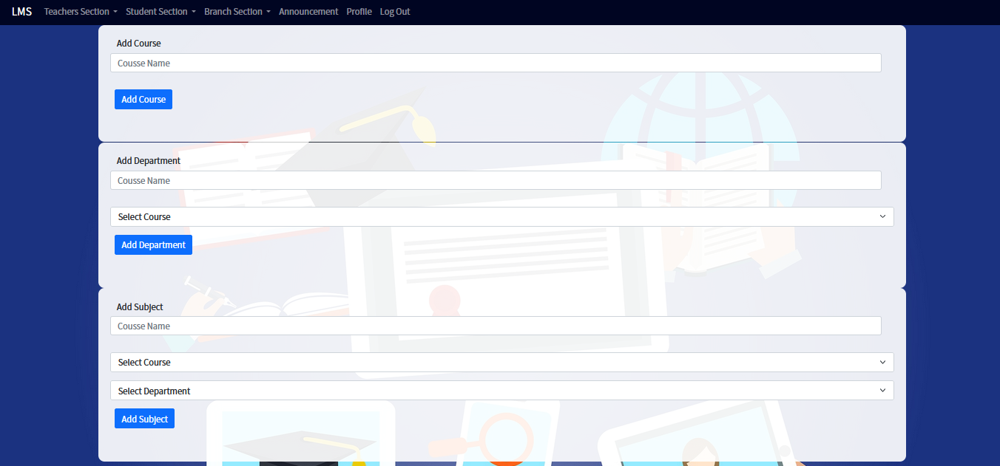

Update & Delte Course

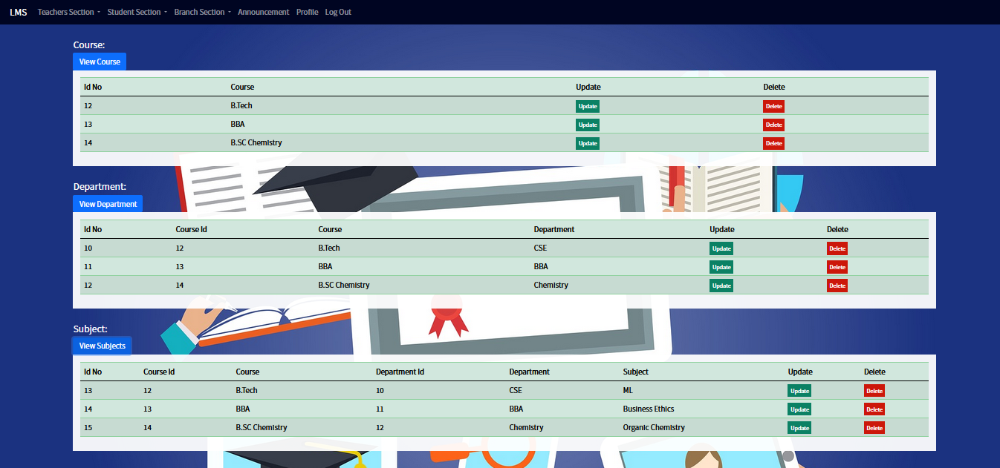

 
<h4>Teacher's Area</h4>
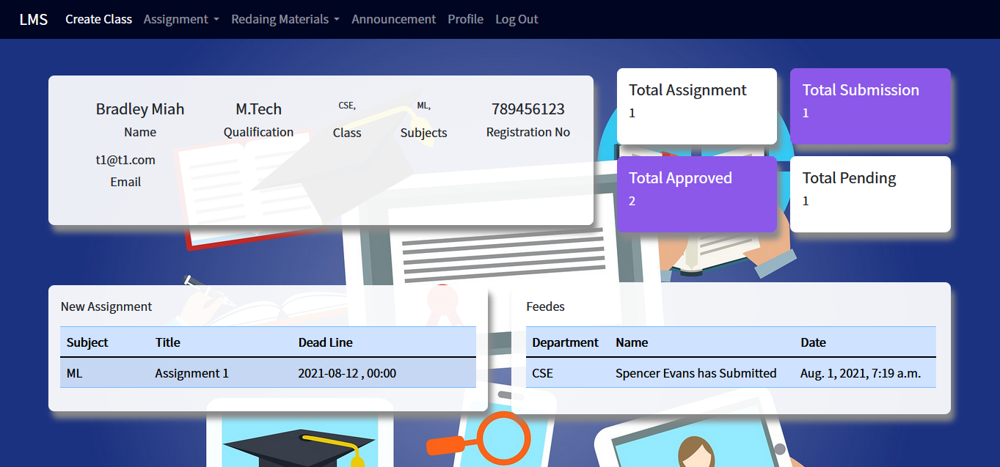

Create Online Class

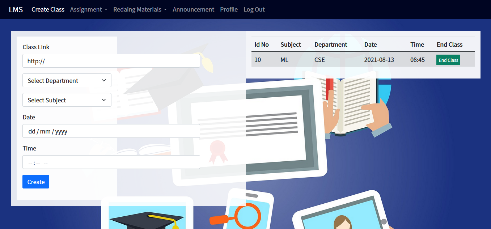

Upload Assignment

View Submission

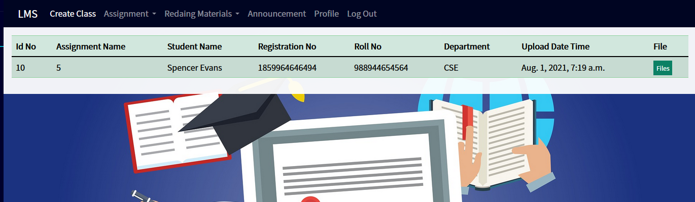

Upload Reading Materials

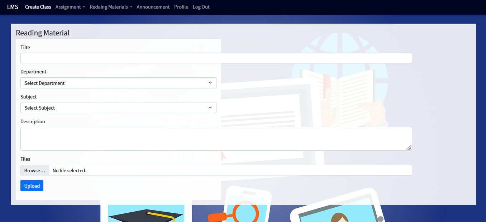

 
<h4>Student's Area</h4>
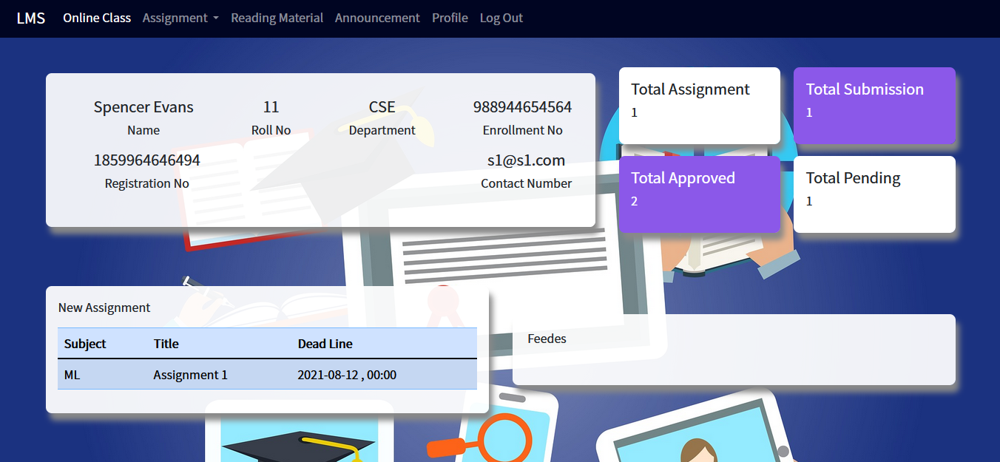

View Online Class

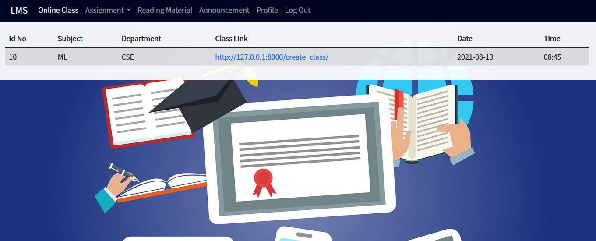

Submit Assignment

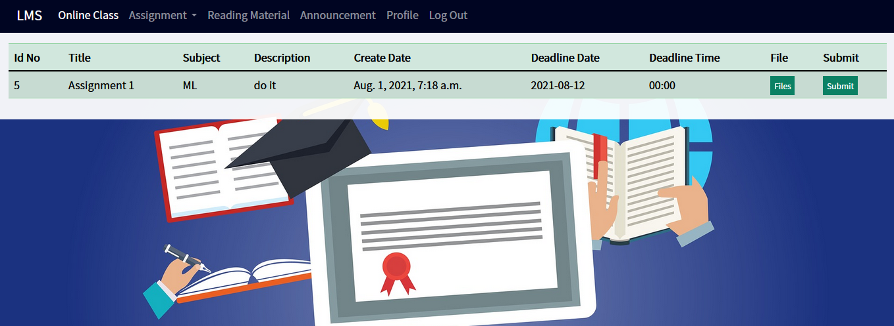

View Reading Materials

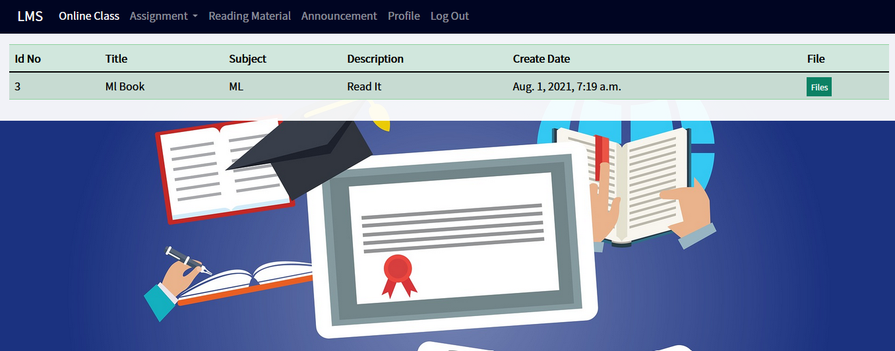