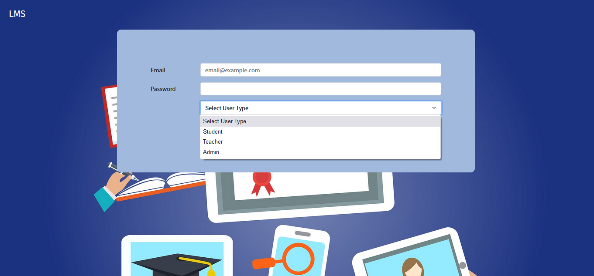
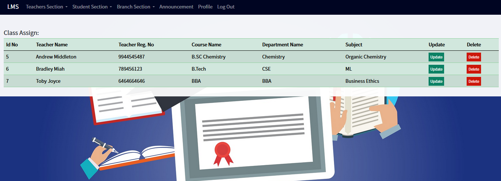

<h1> School Management System Using Django </h1>

<h4>Login Panel</h4>

 
<h4>Admin Area</h4>

Add Teachers

Update & Delete Teachers Details

Assign Class

Update & Delte Assign Class

Add Student
 

Update & Delte Students Details

Add Course

Update & Delte Course

 
<h4>Teacher's Area</h4>

Create Online Class

Upload Assignment

View Submission

Upload Reading Materials

 
<h4>Student's Area</h4>

View Online Class

Submit Assignment

View Reading Materials

